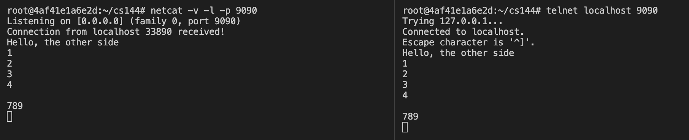

### Fetch a Web page

```console
$ telnet cs144.keithw.org http
Trying 104.196.238.229...
Connected to cs144.keithw.org.
Escape character is '^]'.

GET /hello HTTP/1.1
Host: cs144.keithw.org
Connection: close


HTTP/1.1 200 OK
Date: Wed, 02 Feb 2022 10:48:14 GMT
Server: Apache
Last-Modified: Thu, 13 Dec 2018 15:45:29 GMT
ETag: "e-57ce93446cb64"
Accept-Ranges: bytes
Content-Length: 14
Connection: close
Content-Type: text/plain

Hello, CS144!
Connection closed by foreign host.
```

### Listening and connecting
